# hello!

### about me
I'm a hobbyist Python developer that's interested in low-level iOS.

## projects
| project                                                    | description                                                                                                       |
|------------------------------------------------------------|-------------------------------------------------------------------------------------------------------------------|
| [PyIMG4](https://github.com/m1stadev/PyIMG4)               | A Python library/CLI tool for parsing Apple's [Image4 format](https://www.theiphonewiki.com/wiki/IMG4_File_Format). |
| [lykos](https://github.com/m1stadev/lykos)                 | A Python library/CLI tool for fetching *OS firmware keys.                                                         |
| [AutoTSS](https://github.com/m1stadev/AutoTSS)             | A Discord bot that automatically saves SHSH blobs for all of your iOS devices.                                    |
| [apple-compress](https://github.com/m1stadev/apple-compress) | Python bindings for Apple's libcompression.                                                                     |
| [dmgdec](https://github.com/m1stadev/dmgdec)               | A Python library/CLI tool for decrypting IPSW DMGs.                                                               |

### github stats

